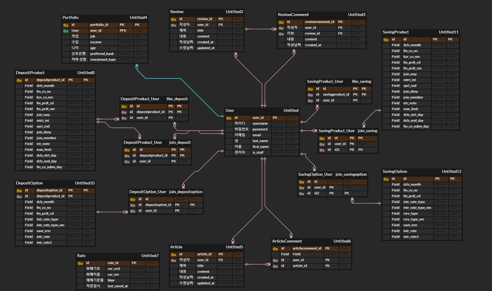

# final_pjt

## 팀원 정보 및 업무분담 내역
팀장: 이수민
팀원: 이연우
- 이수민 : 은행 찾기, 상품 조회
- 이연우 : 유저, 게시판
- 함께 구현 : 환율, 추천 알고리즘

## 설계 내용 및 실제 구현 정도
- 필수요구사항 전부 구현
- 실제 은행 사이트를 참고하여 이자 계산기, 관심상품 저장 기능, 환율 정보 시각화, 사이드바, 특정 상품 비교 기능

## ERD

## 금융 상품 추천 알고리즘에 대한 기술적 설명
사용자에게 포트폴리오를 입력받고 각 항목을 기준으로 상품에 점수를 부여, 점수 부여시 기준마다 가중치를 달리 하여 사용자 맞춤 상품 추천/ 입력받은 항목 : 직업, 연령, 소득, 저축유형, 선호은행 

## 서비스 대표 기능들에 대한 설명
- 환율 : 지난 1년 간 환율 변동 추이를 차트를 통해 보여주고, 사용자가 통화 선택시 해당 통화 1단위당 원화로 환산한 값을 보여주고 사용자 입력을 통해 입력값을 바꿀 수 있도록 함. 버튼을 통해 일정 금액 단위로 환전할 금액을 바꿀 수 있도록 함
- 은행 찾기 : 검색어를 입력하지 않으면 현재 위치 기준으로 은행 검색, 유효한 행정구역 명을 입력하면 은행이 검색되고 다른 키워드로 검색하면 해당 키워드에 맞는 검색결과가 출력됨
- 상품조회: 관심상품으로 해당 상품을 저장한 유저가 많은 순으로 인기 상품을 보여줌/ 은행이름이나 상품명으로 검색 + 상품 종류와 예치 기간별로도 조회가 가능(금리순으로 보여주되, 검색결과의 길이를 사용자가 더보기 버튼을 통해 조절할 수 있도록 하였음)/ 가입자 순, 금리 순으로 정렬 가능 / 상품목록을 보여줄 때 금리와 가입방법이 중요한 정보라고 생각되어 강조하여 보여줌 / 사용자 경험을 고려하여 일부 페이지에서 드래그 막아놓음
- 게시판: 게시글과 댓글 작성 및 수정 기능, 본인이 작성한 글과 댓글만 수정하거나 삭제 가능
,게시글 내용 및 제목으로 검색 가능
- 사용자 프로필: 회원 가입 이후 회원 정보 및 비밀번호 변경 기능, 포트폴리오 생성 및 수정, 가입상품 및 선택옵션 조회 가능 및 차트로 시각화
- 사이드바: 관심상품 및 이자 계산기 기능

## 느낀점 및 후기
- 이수민 : 역할 분담부터 설계, 기능을 구현하는 과정 전반에서 팀원과의 소통이 가장 중요하다는 것을 알게 되었습니다. 서버와 클라이언트 부분을 구분하여 역할을 나누지 않았기 때문에, 본인이 맡은 기능 구현을 위해 장고 프레임워크와 뷰 프레임워크를 모두 사용할 수 있었습니다. 이를 통해 하나의 애플리케이션이 동작하는 과정에서 서버와 클라이언트 사이에 데이터를 어떻게 주고받는지 , 관계형 데이터를 어떻게 관리해야 하는지 고민해 볼 수 있었습니다. 
- 이연우 : 기획했던 것 이상으로 결과물이 나온 것 같아 만족스럽습니다. 잘 맞는 페어를 만나 재밌게 진행했던 프로젝트였습니다.

